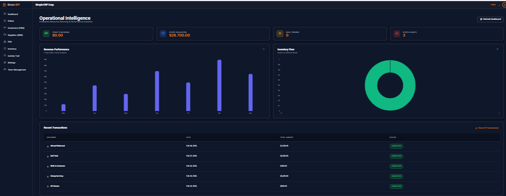
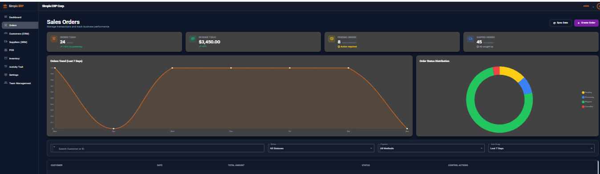
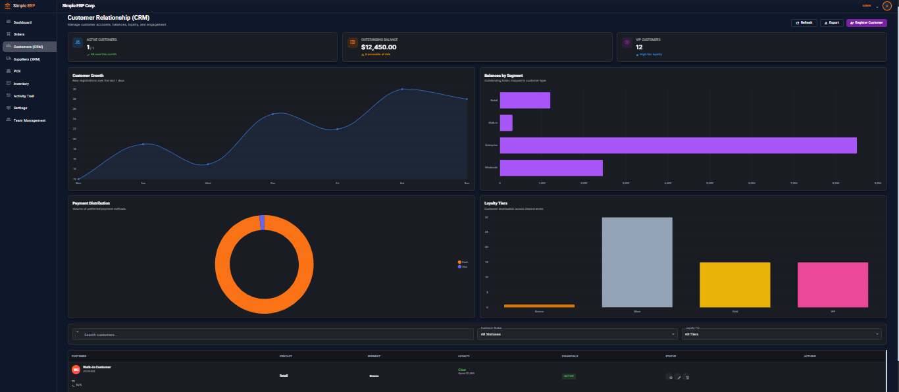
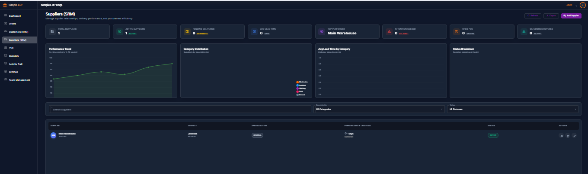
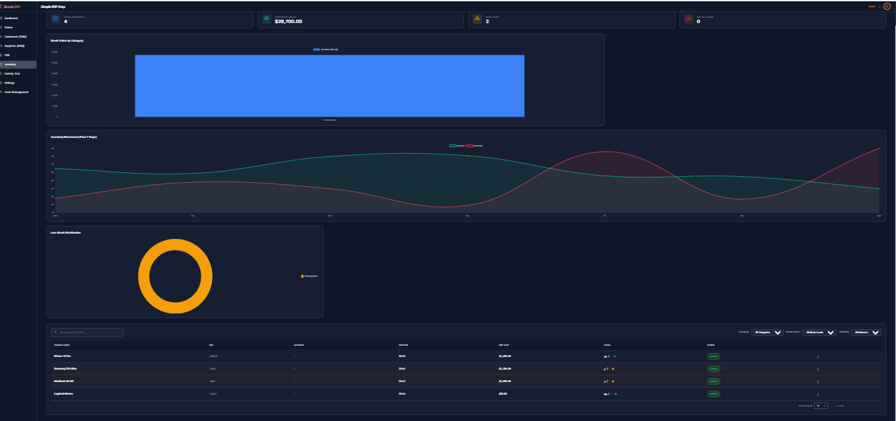
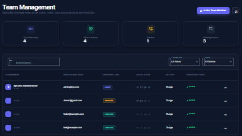

# Simple ERP System

A full-stack **Enterprise Resource Planning (ERP)** web application built with **Angular** and **ASP.NET Core Web API** to manage core business operations through a modern enterprise dashboard.

The system provides a modular architecture designed to handle **orders, customers, suppliers, POS operations, inventory management, and enterprise configuration** within a unified platform.

---

# Demo Preview

## Dashboard



## Orders Management



## Customers CRM



## Suppliers SRM



## invetory System



## team Management



---

# Core Modules

## Dashboard

Operational overview with business analytics and performance insights.

## Orders Management

Create and manage customer orders with a structured workflow.

## Customers (CRM)

Customer relationship management including customer profiles and activity tracking.

## Suppliers (SRM)

Supplier relationship management with sourcing information and delivery tracking.

## POS (Point of Sale)

Retail interface for product selection and order checkout.

## Inventory

Track product availability, stock quantities, and asset management.

## Activity Trail

System-wide audit logging to monitor operations and user activities.

## Settings

Enterprise configuration including company identity and system preferences.

## Team Management

User directory with role-based access control for administrators.

---

# Tech Stack

## Frontend

* Angular
* Angular Material
* SCSS
* Chart.js
* RxJS

## Backend

* ASP.NET Core Web API
* Entity Framework Core
* SQL Server
* JWT Authentication

## Architecture

* RESTful API architecture
* Feature-based Angular structure
* DTO pattern
* Middleware-based exception handling
* Audit logging system

---

# Project Structure

```
Simple-Erp-System
│
├── Simple ERP (Backend - .NET API)
│   └── ASP.NET Core Web API
│
├── Simple ERP (Frontend-Angular)
│   └── Angular application
│
├── screenshots
│   └── UI preview images
│
├── .gitignore
└── README.md
```

---

# Backend Setup

Navigate to backend folder

```
cd "Simple ERP (Backend - .NET API)"
```

Restore packages

```
dotnet restore
```

Apply database migrations

```
dotnet ef database update
```

Run the API

```
dotnet run
```

API will run on:

```
https://localhost:5245
```

Swagger documentation:

```
/swagger
```

---

# Frontend Setup

Navigate to frontend folder

```
cd "Simple ERP (Frontend-Angular)"
```

Install dependencies

```
npm install
```

Run Angular application

```
ng serve
```

Open in browser:

```
http://localhost:4200
```

---

# Authentication

The system uses **JWT authentication** for secure API communication.

Available user roles:

* Admin
* Manager
* Employee

Role guards are implemented in the frontend to control module access.

---

# Key Features

* Modular ERP architecture
* Role-based access control
* Operational dashboard analytics
* POS checkout interface
* Inventory monitoring
* Supplier relationship management
* Customer CRM module
* Activity logging and auditing
* Enterprise configuration panel

---

# Future Improvements

* Advanced reporting module
* Multi-warehouse inventory
* Payment gateway integration
* Notification system
* Exportable financial reports
* Enhanced mobile responsiveness

---

# Author

**Ashraf Marks**

Full Stack Developer

Technology focus:

* Angular
* ASP.NET Core
* REST APIs
* Enterprise Web Applications

---

# License

This project is created for **learning and portfolio purposes**.
